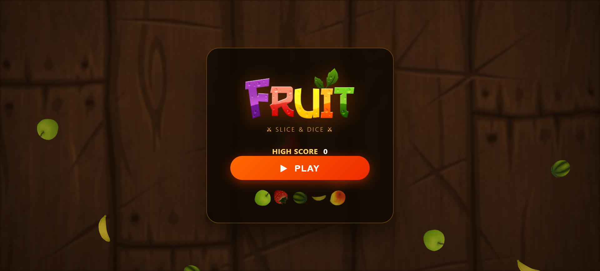
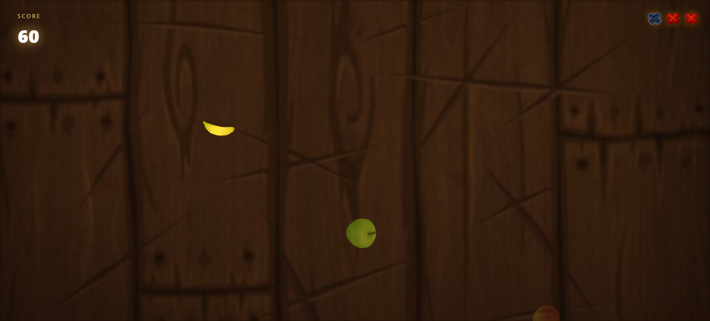
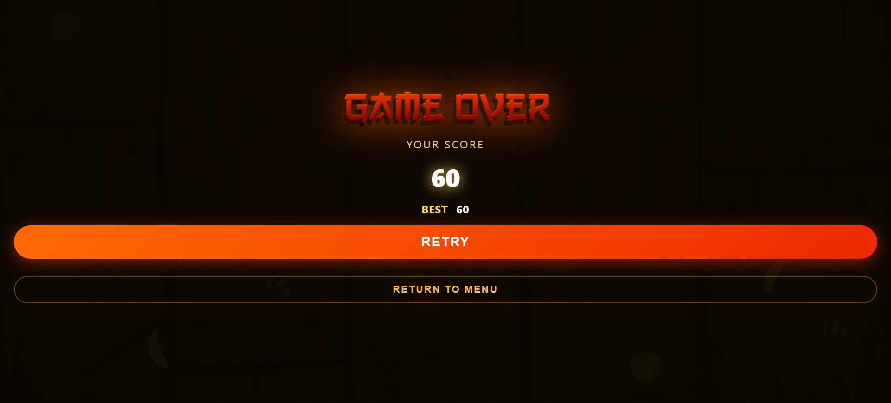

# FruitNinga
A fast-paced browser fruit slicing game with bombs, score streaks, and a polished game over menu.


## Screenshots




## Try it
Open `index.html` in your browser to play immediately.

## Quick Start
1. Clone or download the repo.
2. Open `index.html` in a browser.

If you want a local server instead:
```bash
cd FruitNinga
python -m http.server 8000
```
Then visit `http://localhost:8000`.

## Features
- Swipe to slice flying fruit using mouse movement.
- Bombs appear randomly and penalize missed explosions.
- Score counter with persistent high score saved in `localStorage`.
- Lives system with instant life loss for missed fruit.
- Animated game over overlay with `Retry` and `Return to Menu` controls.
- Progressive difficulty: fruit spawn speed increases the longer you play.

## How to run it locally
This is a static HTML/CSS/JS project, so no build tools are required.

### Option 1: Open directly
- Open `index.html` in Chrome, Firefox, or any modern browser.

### Option 2: Use a simple local server
- Run `python -m http.server 8000`
- Open `http://localhost:8000`

## How it works
The game uses plain DOM elements and CSS animations for each thrown fruit.
Fruit objects are spawned in `script.js`, and the player's cursor movement is tracked to create a slicing effect.
Missed fruit are detected when their throw animation ends, and lives are deducted immediately.
A high score is saved in `localStorage` so the best score persists across browser sessions.

## Credits
Built with vanilla HTML, CSS, and JavaScript.
Game art and fruit assets are included in the `images/` folder.

